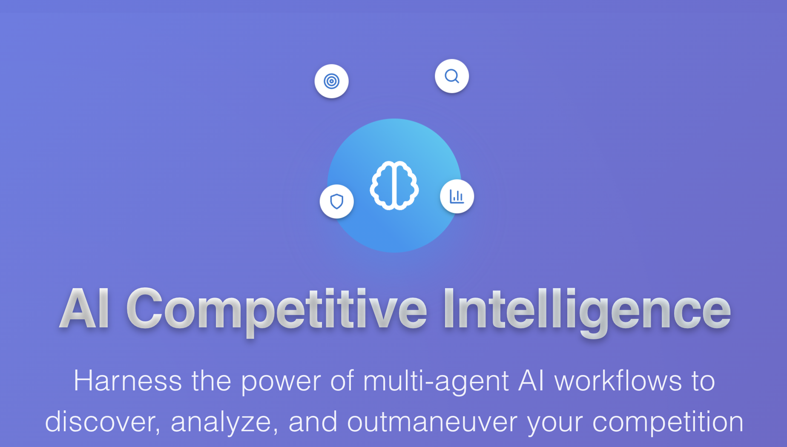
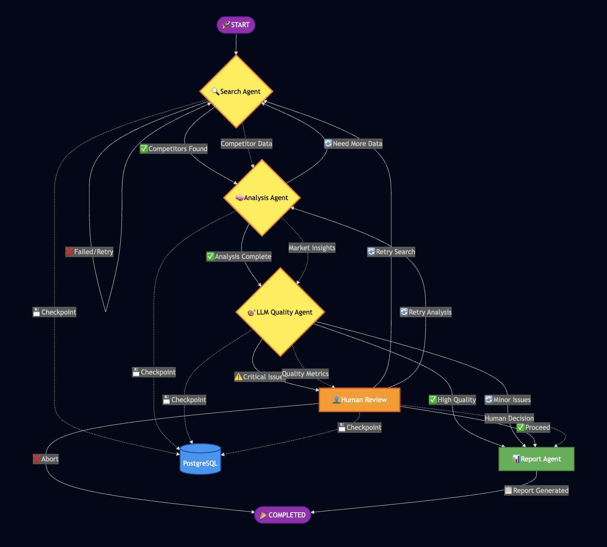
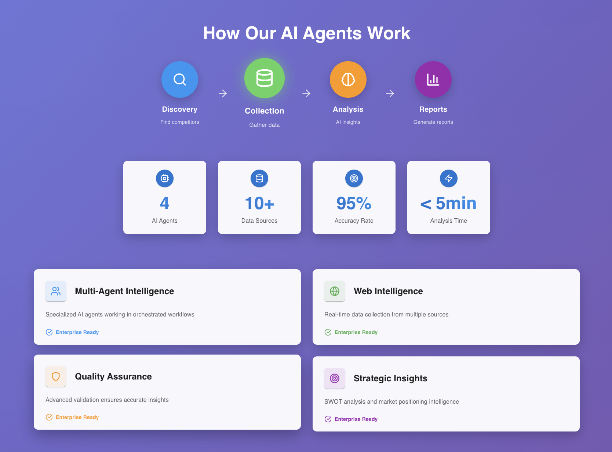

# Competitor Analysis System



> Multi-agent AI-powered competitor analysis system built with LangGraph orchestration

An advanced AI-powered competitor analysis platform that automates the entire competitive intelligence workflow using specialized agents for discovery, data collection, analysis, and reporting.

## 🚀 Features

- **Multi-Agent Architecture**: Specialized agents for different aspects of competitive analysis
- **Intelligent Discovery**: Automated competitor identification using Tavily's web intelligence platform
- **Market Research**: Real-time industry analysis and competitive landscape mapping via Tavily API
- **Deep Analysis**: SWOT analysis, market positioning, and sentiment analysis powered by Azure OpenAI
- **Quality Assurance**: Built-in data validation and relevance filtering with quality scoring
- **Real-time Reporting**: Dynamic report generation with actionable insights
- **Modern Tech Stack**: FastAPI + React with Python 3.12 and uvicorn
- **Scalable Design**: Docker-based deployment with horizontal scaling support

## 🏗️ Architecture



### Multi-Agent System
Built on **LangGraph** with specialized agents:

- **SearchAgent**: Tavily-powered competitor discovery and data collection with intelligent relevance filtering
- **AnalysisAgent**: Azure OpenAI-powered competitive analysis (SWOT, positioning, sentiment)
- **QualityAgent**: Data validation and quality scoring with relevance verification
- **ReportAgent**: Report generation and delivery with market insights
- **CompetitorAnalysisCoordinator**: Main orchestrator managing agent workflow and checkpoints

*Note: Unused agent files have been removed to streamline the codebase. Only the active agents listed above are included.*

### Tech Stack

**Backend:**
- FastAPI with Python 3.12+ and uvicorn
- LangGraph for agent workflow management
- Azure OpenAI GPT-4 for competitive analysis and data structuring
- Tavily API for web intelligence, competitor discovery, and market research
- MongoDB for analysis results and business data persistence
- PostgreSQL for LangGraph checkpoint persistence
- Redis for session management and caching

**Frontend:**
- React 18 + TypeScript
- Material-UI components
- Real-time WebSocket updates
- Data visualization components

**Infrastructure:**
- Docker & Docker Compose for containerization
- Uvicorn ASGI server for high-performance API serving
- AWS Elastic Beanstalk for cloud deployment
- Modern Python project structure with pyproject.toml

*For detailed infrastructure information, see [INFRASTRUCTURE.md](./INFRASTRUCTURE.md)*

## 📁 Project Structure
```
competitor-analysis-system/
├── backend/
│   ├── agents/           # LangGraph agents
│   ├── api/             # FastAPI endpoints
│   ├── config/          # Configuration
│   ├── database/        # MongoDB models
│   ├── services/        # Business logic
│   └── utils/           # Utilities
├── frontend/
│   ├── src/
│   │   ├── components/  # React components
│   │   ├── pages/       # Page components
│   │   ├── services/    # API services
│   │   └── types/       # TypeScript types
│   └── public/
├── docker-compose.yml
├── Makefile
└── README.md
```

## 🚀 Quick Start

### Prerequisites

- **Python 3.12+** (3.10+ supported)
- **Node.js 16+** and npm
- **Docker & Docker Compose**
- **Git**

### Option 1: Quick Local Setup (Recommended)

```bash
# Clone the repository
git clone <repository-url>
cd competitor-analysis-system

# Initialize project with all dependencies
make init

# Configure environment
cp backend/.env.example backend/.env
# Edit backend/.env and add your API keys

# Start full stack development environment
make local
```

### Option 2: Manual Setup

```bash
# 1. Create virtual environment
python3.12 -m venv venv
source venv/bin/activate

# 2. Install backend dependencies
cd backend && pip install -r requirements.txt && cd ..

# 3. Install frontend dependencies
cd frontend && npm install && cd ..

# 4. Configure environment
cp backend/.env.example backend/.env

# 5. Start databases and services
make local
```

### Option 3: Docker Development

```bash
# Initialize project
make init

# Start full Docker development environment
make dev
```

## 🔧 Configuration

### Environment Variables

Create `backend/.env` with the following configuration:

```env
# Required API Keys
OPENAI_API_KEY=your_openai_api_key_here
TAVILY_API_KEY=your_tavily_api_key_here

# Application Settings
ENVIRONMENT=development
LOG_LEVEL=info
API_VERSION=v1

# Security
SECRET_KEY=your_secret_key_here
ALGORITHM=HS256
ACCESS_TOKEN_EXPIRE_MINUTES=30
```

### API Keys Setup

1. **Azure OpenAI API Key**: Get from [Azure OpenAI Service](https://azure.microsoft.com/en-us/products/ai-services/openai-service)
2. **Tavily API Key**: Get from [Tavily API](https://tavily.com/) - Required for web intelligence and competitor discovery

**Tavily API Usage:**
- Competitor discovery through intelligent web search
- Market research and industry analysis
- Real-time competitive intelligence gathering
- Content relevance scoring and validation

## 🌐 Service Endpoints

| Service | URL | Description |
|---------|-----|-------------|
| Frontend | http://localhost:3000 | React application |
| Backend API | http://localhost:8000 | FastAPI server |
| API Documentation | http://localhost:8000/docs | Swagger UI |
| MongoDB | localhost:27017 | Database |
| Redis | localhost:6379 | Cache |

## 📊 Usage

### Starting Analysis

```bash
# Via API
curl -X POST "http://localhost:8000/api/v1/competitor-analysis/start" \
  -H "Content-Type: application/json" \
  -d '{
    "company_name": "Your Company",
    "industry": "Technology",
    "description": "AI-powered solutions"
  }'

# Via Web Interface
# Navigate to http://localhost:3000
```

### Monitoring Progress

```bash
# WebSocket connection for real-time updates
ws://localhost:8000/ws/analysis/{analysis_id}

# REST API polling
GET /api/v1/competitor-analysis/status/{analysis_id}
```

### Retrieving Results

```bash
# Get completed analysis
GET /api/v1/competitor-analysis/results/{analysis_id}
```

## 🛠️ Development

### Available Commands

```bash
# Project management
make help          # Show all commands
make install       # Install dependencies
make init          # Initialize project

# Development
make local         # Run backend locally
make local-full    # Run full stack locally
make dev           # Docker development
make up            # Docker production

# Testing
make test          # Run all tests
./scripts/test.sh  # Run tests with coverage

# Docker operations
make build         # Build images
make logs          # View logs
make clean         # Clean containers

# Database
make db-shell      # MongoDB shell
make redis-cli     # Redis CLI
```

## 🔄 Workflow


**Actual LangGraph Implementation:**

1. **Search Phase** - Tavily-powered competitor discovery and data collection with intelligent filtering
2. **Analysis Phase** - Azure OpenAI competitive analysis with SWOT, positioning, and data enrichment
3. **Quality Assurance** - LLM-powered data validation and relevance verification
4. **Human Review** - Optional interruption point for quality issues requiring human decision
5. **Report Generation** - Automated report synthesis with market insights and recommendations
6. **Completion** - Analysis marked complete with persistent checkpoint storage

**Key Features:**
- **Persistent Interrupts**: LangGraph checkpoints enable human review workflows that can resume exactly where they left off
- **Conditional Routing**: Smart workflow routing based on data quality and analysis confidence
- **Error Recovery**: Built-in retry mechanisms and fallback strategies
- **Real-time Updates**: WebSocket progress tracking throughout the workflow



## 📈 Performance Metrics
- Analysis completion: < 4 hours
- Data accuracy: > 90%
- Competitor discovery: > 95% relevance
- System uptime: > 99.5%

## 🤝 Contributing
Please read CONTRIBUTING.md for details on our code of conduct and the process for submitting pull requests.

## 📝 License
This project is licensed under the MIT License - see the LICENSE file for details.

## 🙏 Acknowledgments
- LangGraph for multi-agent orchestration framework
- Tavily for intelligent web search and competitive intelligence platform
- Azure OpenAI for GPT-4 analysis capabilities

## 📞 Support
For support, email support@competitoranalysis.ai or open an issue in the repository.
